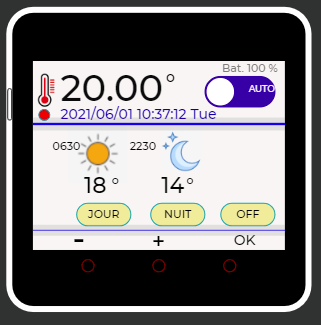

M5Stack Core 2 regulated thermostat
===================================

Author:     X. Mayeur
Version:    v1.0

Hardware:   M5Stack Core2
            DHT22 on pin 33
            mini relay module on pin 32

Function:

- This program read the DTH22 temperature and regulate it using a reference temperature
- The regulator is a simple hysteresis comparator switching a relay on and off if the actual temperature
differs from more than 1°C with respect to the reference temperature
- The reference temperature is adjusted according to a weekly schedule having one or more periods to
switch between the day and night temperature references. A period has a start and end hour (format 'HHMM')
for which the reference temperature will be day temperature reference
- Day and night temperature references are editable via the screen using the displayed buttons
- Week schedule is not editable from UI but can be set by publishing it via mqtt
on the topic thermostat/weekSchedule
- The thermostat can be switched to the following modes:
    - OFF: relay stays open forever - thermostat is OFF
    - ON: relays stays closed for the next 5 minutes then switch to AUTO
    - AUTO: the temperature is regulated according to week schedule
    - DAY: the temperature is regulated to the day reference temperature until the next day
    - NIGHT: the temperature is regulated to the night reference temperature until the next day
- A touch on the middle of the display toggle the screen brightness between 15% and 100%.
  the screen is always dimmed to 15% after 30 sec.

Display:

- Upper section shows:
    - a thermometer icon, followed by the acual measured temperature and followed by the thermostat mode switch
    - the switch allows to move between automatic mode, or forced day or night regulated temperature
    - above the switch, the charge of the internal M5Stack battery is shown, in case of deconnection from its main supply
    - a small red dot under the thermometer icon indicates that the relay is actually closed
    - the full date / time is display and refresh every second.

- the middle section shows:
    - a sun icon, with the current schedule start/end hour & minutes, and with the day reference
     temperature below
    - a moon icon, with the night reference temperature below

- bottom section:
    - three yellow buttons:
        - "day": edit the day reference temperature
        - "night": edit the night reference temperature
        - mode: OFF -> ON -> AUTO mode switch
    - in edit mode:
        - plus / minus / OK buttons
